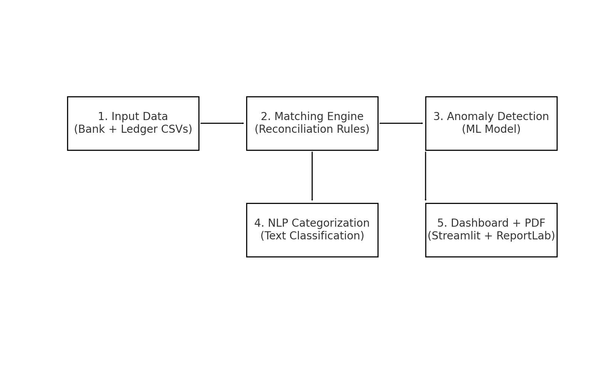

# 📊 Smart Financial Reconciliation – Analytics Console

<!-- Badges -->
<p align="center">

  <!-- Python -->
  <a href="https://www.python.org/">
    
  </a>

  <!-- Streamlit -->
  <a href="https://streamlit.io/">
    
  </a>

  <!-- Machine Learning -->
  

  <!-- NLP -->
  

  <!-- License -->
  

  <!-- Issues -->
  

  <!-- Stars -->
  

</p>


A complete end-to-end **Financial Data Reconciliation System** built using:

✅ Python  
✅ Machine Learning  
✅ Anomaly Detection  
✅ NLP Categorization  
✅ Streamlit Dashboard  
✅ Automated PDF Report Generation  

This system helps finance teams **detect mismatches between bank statements and ledger entries**, classify transactions, identify anomalies, and generate executive reports.

---

## 🚀 Features

### ✅ 1. Automated Reconciliation
- Matches bank & ledger entries  
- Detects:
  - Amount mismatch  
  - Date mismatch  
  - Missing in bank  
  - Missing in ledger  
  - Duplicate entries  
  - Ghost/Unmapped records  

### ✅ 2. Machine Learning Anomaly Detection
- Identifies outliers using Isolation Forest  
- Flags unusual amount differences  
- Flags date gaps  
- Detects missing and duplicate ledger/bank entries  

### ✅ 3. NLP Transaction Categorization
- Uses ML-based text classification  
- Assigns categories like:
  - Food  
  - Travel  
  - Fuel  
  - Insurance  
  - Subscription  
  - Salary  
  - Shopping  
  - Utility Bills  
  - Wallet Payments  

### ✅ 4. Streamlit Analytics Dashboard
- KPI cards for matched, mismatched, anomalies  
- Root cause breakdown charts  
- Match status visualization  
- Anomaly insights  
- Category distribution charts  
- Detailed drill-down tables  
- CSV export buttons  
- **Auto-load default dataset or upload your own CSVs**

### ✅ 5. One-Click Executive PDF Report
- Overview of reconciliation  
- KPI metrics  
- ML anomaly charts  
- NLP category charts  
- Top suspicious transactions  
- Recommendations  
- Professionally formatted PDF  

---

## 📁 Project Structure

```
Smart-Financial-Reconciliation/
│
├── data/
│   ├── bank_statement.csv
│   ├── ledger_entries.csv
│   ├── transactions.csv
│
├── src/
│   ├── app.py                     # Streamlit UI
│   ├── utils.py                   # Helper functions
│   ├── anomaly.py                 # ML anomaly detection
│   ├── recommendation_engine.py   # Recommendations
│   ├── transaction_classifier.py  # NLP categorizer
│   ├── report_pdf.py              # PDF generator
│   └── generate_large_dataset.py  # Synthetic dataset creator
│
├── requirements.txt
├── README.md
└── .gitignore
```
## 🎥 Project Demo

<p align="center">
  
</p>

## 🧩 How It Works

<p align="center">
  
</p>


---

## 🛠️ Installation

### 1️⃣ Clone the repository
```bash
git clone https://github.com/sonu-kumar-singh-lpu/Smart-Financial-Reconciliation.git
cd Smart-Financial-Reconciliation
```

---


###  Install dependencies

```bash
python -m pip install -r requirements.txt
```

---

###  Run the Streamlit application

```bash
python -m streamlit run src/app.py
```

Your full analytics dashboard will open inside your browser.

---


---

## ✅ Conclusion

This project provides a complete ML-powered reconciliation workflow suitable for  
✅ Finance teams  
✅ Accounting automation  
✅ Auditing workflows  
✅ Enterprise reconciliation systems  
✅ Academic & portfolio ML projects  

---
